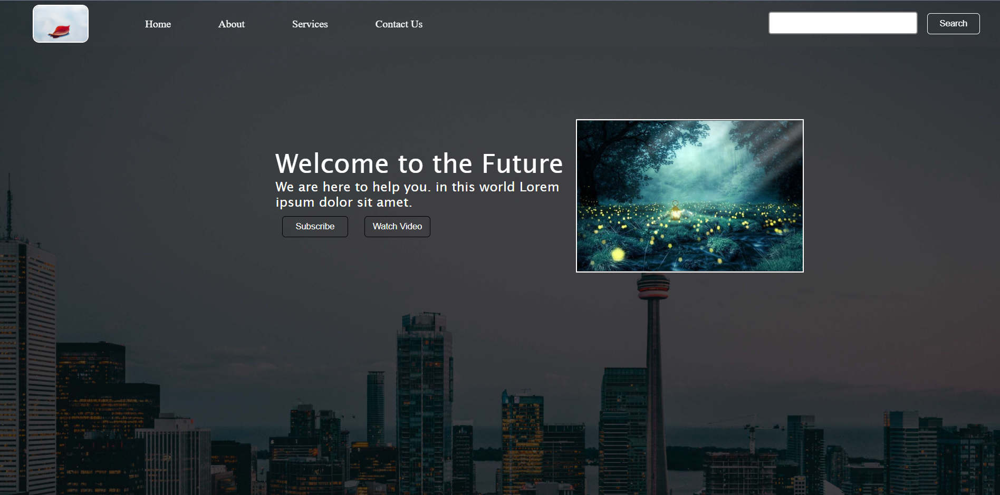

## Website 
This is a example of simple landing page **Static Webpage**.


## **Description**
This is a static webpage creating using **HTML, CSS** & **JS**.

### Express

Express is a node JS framework using to serve this type of webpages easily.

## **Installation**

### Softeares Required :

- [visual Studio Code](https://code.visualstudio.com/download)
- [Node.js](https://nodejs.org/en/)

## **Libraries :**

- [Express](https://expressjs.com/)

_Just install nodeJS & VS Code, open the repository on VS code and start working._

### Start the Server :

#### Initial Set Up:

```
npm i
```

#### For deployment:

```
nodemon ./app.js
```

#### For deployment:

```
node ./app.js
```

## **Deployment**

Clone the repo and edit and also host it on a Free [Heroku Account](https://www.heroku.com/platform). 
 
 ## **Languages**

- 
  <br>
  <br>
  <br>
 ## Projects Pictures 

 


## **Contribution**

This is a concept for beginners starting with static webpages. Feel free to fork, clone, create issues and/or make PRs. We will be more than happy to receive your contributions.

## **Announcement**

The webpage HOST on [here](https://test-case-004.herokuapp.com/#Home)

https://test-case-004.herokuapp.com/#Home

